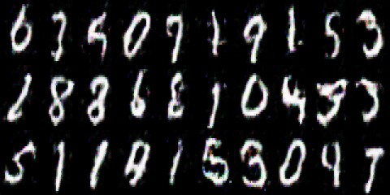

# Generative Adversarial Network Models
A collection of generative adversarial network models, e.g. GAN, FGAN, SoftmaxGAN, LSGAN in Tensorflow.  

## How to use?
- Command 1: `python train.py gan_name train`  
- Command 2: `python train.py gan_name generate`  

Note: Generated samples will be stored in `images/{gan_model}/` directory during training.

## Standard GANs

  

**Description**: The Generator is similar to a Decoder whereas the Discriminator is in the form of an Encoder.

- GAN: Generative Adversarial Networks
	- Date: 2014-06
	- Paper: [Generative Adversarial Networks](https://arxiv.org/abs/1406.2661)  
	- Loss functions (Minimization):  
	- 
- DCGAN: Deep Convolutional GAN
	- Date: 2016-01
	- Paper: [Unsupervised Representation Learning with Deep Convolutional Generative Adversarial Networks](https://arxiv.org/abs/1511.06434)  
	- Loss functions (Minimization):  
	- 
- FGAN: f-GAN
	- Date: 2016-06
	- Paper: [f-GAN: Training Generative Neural Samplers using Variational Divergence Minimization](https://arxiv.org/abs/1606.00709)  
	- Loss functions (Minimization):  
	- 
- SoftmaxGAN: Softmax GAN
	- Date: 2017-04
	- Paper: [Softmax GAN](https://arxiv.org/abs/1704.06191)  
	- Loss functions (Minimization):  
	- 
- LSGAN: Least Squares GAN
	- Date: 2017-04
	- Paper: [Least Squares Generative Adversarial Networks](https://arxiv.org/abs/1611.04076)  
	- Loss functions (Minimization):  
	- 
- WGAN: Wasserstein GAN
	- Date: 2017-12
	- Paper: [Wasserstein GAN](https://arxiv.org/abs/1701.07875)  
	- Loss functions (Minimization):  
	- 
- WGAN_GP: Wasserstein GAN with Gradient Penalty
	- Date: 2017-12
	- Paper: [Improved Training of Wasserstein GANs](https://arxiv.org/abs/1704.00028)  
	- Loss functions (Minimization):  
	- 
- DRAGAN: Deep Regret Analytic GAN
	- Date: 2017-12
	- Paper: [On Convergence and Stability of GANs](https://arxiv.org/abs/1705.07215)  
	- Loss functions (Minimization):  
	- 
- BGAN: Boundary-Seeking GAN
	- Date: 2018-02
	- Paper: [Boundary-Seeking Generative Adversarial Networks](https://arxiv.org/abs/1702.08431)  
	- Loss functions (Minimization):  
	- 

## MNIST Results
The following results can be reproduced with the command:  
```
python train.py gan_name train
```

### Standard GANs Results

*Name* | *Epoch 1* | *Epoch 2* | *Epoch 3*
:---: | :---: | :---: | :---: |
GAN |  |  |
DCGAN |  | |
FGAN |  | |
SoftmaxGAN |  | |
LSGAN |  | |
DRAGAN |  | |
WGAN |  | |
WGAN_GP |  | |
BGAN |  | |

## Dependencies

1. Install miniconda <https://docs.conda.io/en/latest/miniconda.html>
2. Create an environment 	`conda create --name autoencoder`
3. Activate the environment `source activate autoencoder`
4. Install [Tensorflow] 	`conda install -c conda-forge tensorflow`
5. Install [Opencv] 		`conda install -c conda-forge opencv`
6. Install [sklearn] 		`conda install -c anaconda scikit-learn`
7. Install [matplotlib] 	`conda install -c conda-forge matplotlib`

## Datasets
If you wanna try new dataset, please make sure you make it in the following way:
- Dataset_main_directory
	- train_data
		- category_1: (image1, image2, ...)
		- category_2: (image1, image2, ...)
		- ...
	- test_data
		- category_1: (image1, image2, ...)
		- category_2: (image1, image2, ...)
		- ...

The `loader.py` file will automatically upload all images and their labels (category_i folders)

## Acknowledgements
This implementation has been based on the work of the great following repositories:
- https://github.com/hwalsuklee/tensorflow-generative-model-collections
- https://github.com/wiseodd/generative-models
- https://github.com/eriklindernoren/Keras-GAN
